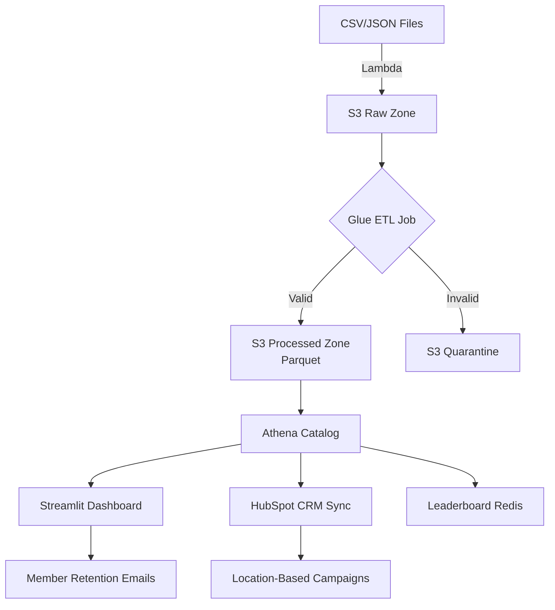

PEAK FITNESS - TECHNICAL DESIGN DOCUMENT

1. Scope
In Scope

✅ End-to-end data pipeline (Lambda/Glue/Athena)
✅ Streamlit dashboard with leaderboard
✅ HubSpot CRM sync for churned users
✅ Email campaigns (SES)
✅ Free Tier cost optimization
Out of Scope

⛔ Real-time streaming (Kinesis)
⛔ Multi-cloud deployment
⛔ Advanced ML model training

Future Handling:

    Real-time: Add Kinesis if engagement grows

    ML: SageMaker Autopilot after MVP

2. Technical Architecture Diagram
"C:\Users\Kris OH\Documents\AWS Cloud Essential Course\Project\Design Document\deepseek_mermaid_20250506_455c7e.png"

    

Data Flow

    Ingest: Lambda converts CSVs → Parquet

    Process: Glue Spark cleans/partitions data

    Serve: Athena queries power Streamlit/HubSpot

    Act: Emails sent via SES

3. Proposed Tech Stack
Tool	Use Case	Reason
AWS Lambda	ETL, CRM Sync	Free Tier, event-driven
Glue Spark	Parquet conversion	Resume-worthy, OLAP-ready
Athena	Analytics	Pay-per-query, no infra
Streamlit	Dashboard	Python-native, embeddable
4. Design Decisions & Tradeoffs
Decision	Pros	Cons
Lambda over Kinesis	$0 cost at low volume	No real-time
Athena over Redshift	No cluster management	Slower for joins
Glue over EMR	Fully managed	Limited customization
5. Data Management
Integration Pattern

    Type: Batch (daily)

    Direction: Outbound (Athena → HubSpot)

    Tech: Lambda pulls Athena → HubSpot API

Storage Layers
Layer	Format	Purpose	Retention
Raw	CSV/JSON	Audit trail	30 days
Processed	Parquet	Analytics	1 year
Aggregated	Redis	Leaderboard	7 days
Data Model (Star Schema)

FACT_ATTENDANCE (user_id, class_id, dt)  
DIM_USERS (user_id, location, join_date)  
DIM_CLASSES (class_id, instructor, time)  

6. Practicalities
Cost Estimates
Service	Monthly Cost
AWS Glue	$1.20
Athena	$0.50
HubSpot	$0.00
Timeline
Phase	Duration
ETL Build	3 days
Dashboard	2 days
CRM Sync	1 day
Security

    PII Handling: Email/location only

    Approvals: None required (Free Tier only)

7. Current Status
diff

+ COMPLETED:
- Lambda ETL
- Athena setup
- Sample analyses

! NEXT:
1. Streamlit leaderboard (code ready)
2. HubSpot sync (awaiting API key)
3. SES template approval